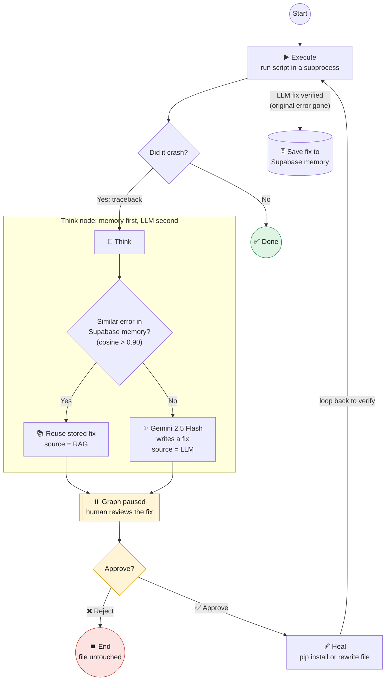
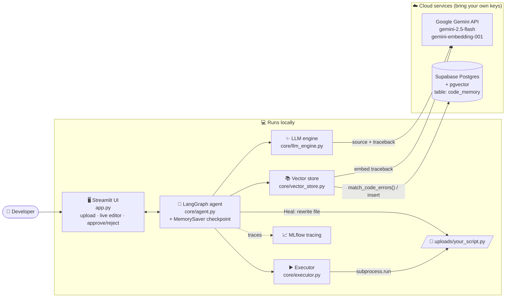
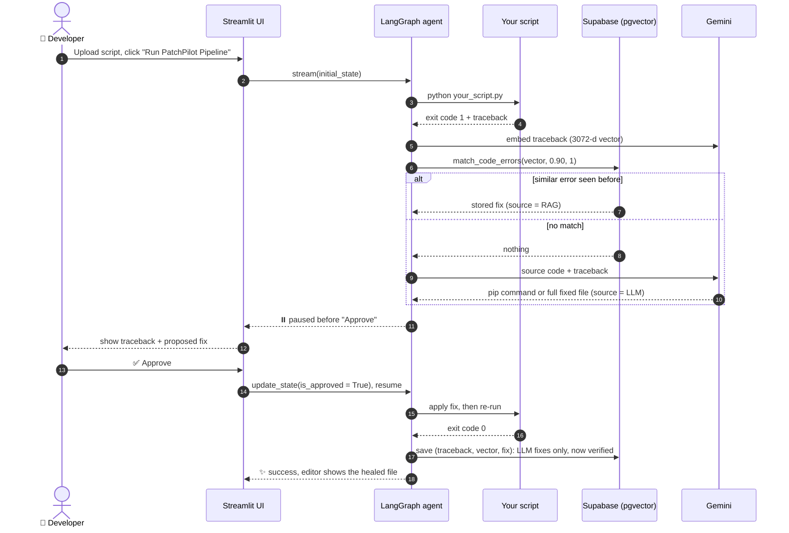
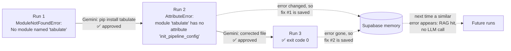
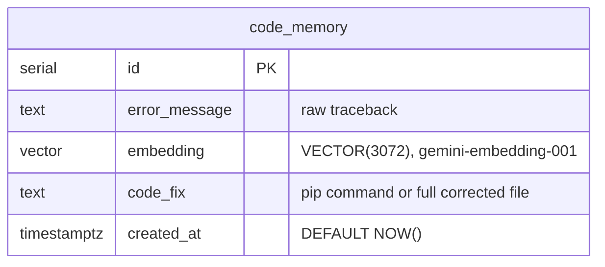

# 🚀 PatchPilot: Autonomous Code-Healing Agent


> **A LangGraph agent that runs a broken Python script, catches the traceback, finds a fix (from its own vector memory first, Google Gemini second), waits for a human to approve it, applies it, re-runs the script to verify it, and remembers the fixes that worked.**

> **Status:** actively developed. See [Known limitations](#-known-limitations) and the [Roadmap](#-roadmap).

---

## 📌 Overview

Most "AI debugging" tools stop at *explaining* an error. PatchPilot closes the loop:

| Step | What happens | Where |
| --- | --- | --- |
| 1. **Execute** | Runs the script in a subprocess and captures `stderr` on failure | [`core/executor.py`](core/executor.py) |
| 2. **Remember** | Embeds the traceback and searches past fixes in Supabase (pgvector, cosine similarity above 0.90) | [`core/vector_store.py`](core/vector_store.py) |
| 3. **Reason** | On a memory miss, asks Gemini 2.5 Flash for a `pip install …` command *or* a fully corrected file | [`core/llm_engine.py`](core/llm_engine.py) |
| 4. **Ask** | Freezes the graph and shows the fix in the UI. Nothing is changed until a human clicks **Approve** | [`app.py`](app.py) |
| 5. **Heal** | Installs the package or rewrites the file | [`core/agent.py`](core/agent.py) |
| 6. **Verify & learn** | Re-runs the script. If the original error is gone, the LLM's fix is saved to memory, so the next similar error is solved **without an LLM call** | [`core/agent.py`](core/agent.py) |

If the re-run hits a *new* error, the loop starts again, so a script with several bugs gets fixed one bug at a time.

<!-- Demo GIF: record a 15–30 s capture of the flow below, save it as docs/demo.gif and embed it here. -->

---

## 🧠 How the agent works

PatchPilot is a **LangGraph state machine** with four nodes. The graph is compiled with a checkpointer and `interrupt_before=["Approve"]`, so it physically stops before any change is made and resumes only when the UI tells it to.



### The shared agent state

Every node reads and writes one typed dictionary (`AgentState` in [`core/agent.py`](core/agent.py)):

| Field | Meaning |
| --- | --- |
| `file_path` | The script being healed |
| `error_traceback` | `stderr` from the last run (empty string = the script ran cleanly) |
| `proposed_fix` | Either a `pip install …` command or the full corrected source file |
| `source` | `"RAG"` (fix came from memory) or `"LLM"` (fix came from Gemini) |
| `is_approved` | Set by the UI when the human clicks Approve or Reject |

---

## 🏗️ System architecture



---

## 🔁 One healing cycle, step by step



---

## 🧪 Worked example: the included demo script

[`examples/demo_broken_script.py`](examples/demo_broken_script.py) has **two bugs that only appear one after the other**, which shows off the loop:



---

## 🗄️ Memory schema

One table plus one SQL function ([`database/schema.sql`](database/schema.sql), [`database/init.sql`](database/init.sql)):



`match_code_errors(query_embedding, match_threshold, match_count)` returns the closest rows by cosine similarity (`1 - (embedding <=> query)`) above the threshold. No ANN index is created on purpose: pgvector's `ivfflat`/`hnsw` indexes cap out at 2,000 dimensions, and exact search is fast at this scale.

---

## 🛠 Technology stack

| Layer | Technology | Used for |
| --- | --- | --- |
| Agent orchestration | **LangGraph** (`StateGraph`, `MemorySaver`, `interrupt_before`) | State machine, pause/resume for human approval |
| LLM | **Google Gemini 2.5 Flash** (`google-genai` SDK) | Generating fixes |
| Embeddings | **gemini-embedding-001** (3072-d) | Turning tracebacks into vectors |
| Vector memory | **Supabase** Postgres + **pgvector** | Storing and searching verified fixes |
| UI | **Streamlit** | Upload, live editor, approval panel, download |
| LLMOps | **MLflow** Tracing | LangGraph node spans + Gemini prompts, responses and token usage |
| Language | **Python 3.10+** | |

---

## 📂 Project structure

```text
PatchPilot-Autonomous-Agent/
├── app.py                      # Streamlit UI: upload, live editor, run, approve / reject, download
├── core/
│   ├── agent.py                # LangGraph state machine (Execute → Think → Approve → Heal → Execute)
│   ├── executor.py             # Runs the target script in a subprocess, captures the traceback
│   ├── vector_store.py         # Gemini embeddings + Supabase search / insert (RAG memory)
│   └── llm_engine.py           # Gemini 2.5 Flash prompt that returns a pip command or a fixed file
├── database/
│   ├── schema.sql              # Step 1: pgvector extension + code_memory table
│   └── init.sql                # Step 2: match_code_errors() similarity-search function
├── examples/
│   └── demo_broken_script.py   # Script with two bugs for trying PatchPilot
├── tests/
│   └── test_agent.py           # Offline test of the whole graph loop (Gemini and Supabase faked)
├── requirements.txt
├── .env.example
└── LICENSE
```

---

## ⚙️ Getting started

### Prerequisites

* Python **3.10+**
* A free [Supabase](https://supabase.com) project
* A [Google AI Studio](https://aistudio.google.com/apikey) API key

### 1. Clone and install

```bash
git clone https://github.com/Harshit-Poddar90/PatchPilot-Autonomous-Agent.git
cd PatchPilot-Autonomous-Agent
python -m venv .venv
```

Activate the virtual environment (Windows: `.venv\Scripts\activate`, macOS/Linux: `source .venv/bin/activate`), then:

```bash
pip install -r requirements.txt
```

### 2. Add your keys

Copy `.env.example` to `.env` and fill it in (`.env` is git-ignored):

```env
GEMINI_API_KEY="your_google_ai_key"
SUPABASE_URL="your_supabase_project_url"
SUPABASE_ANON_KEY="your_supabase_anon_key"
```

### 3. Create the memory database

In the Supabase dashboard, open **SQL Editor** and run, in this order:

1. [`database/schema.sql`](database/schema.sql): enables pgvector and creates the `code_memory` table
2. [`database/init.sql`](database/init.sql): creates the `match_code_errors` search function

### 4. Run it

```bash
streamlit run app.py
```

1. Upload a broken `.py` file in the sidebar (try [`examples/demo_broken_script.py`](examples/demo_broken_script.py)).
2. Click **🚀 Run PatchPilot Pipeline**.
3. Review the traceback and the proposed fix. The panel shows whether it came from **RAG** memory or the **LLM**.
4. Click **✅ Approve & Heal File** to apply it, or **❌ Reject Fix** to stop without touching the file.
5. PatchPilot re-runs the script and repeats until it passes. You can also edit the code yourself in the live editor and download the healed script.

### 5. Run the tests (no API keys needed)

```bash
python tests/test_agent.py
```

This drives the real LangGraph graph end to end with Gemini and Supabase faked. It checks that the graph pauses for approval, that **Approve** heals the file and memorizes the fix only *after* the re-run passes, that a fix which doesn't work is never memorized, and that **Reject** leaves the file untouched.

---

## 📈 Observability with MLflow

[`core/agent.py`](core/agent.py) turns on two MLflow autologgers:

* `mlflow.langchain.autolog()` records a trace per graph run with a span per node (inputs, outputs, latency).
* `mlflow.gemini.autolog()` records every Gemini call: prompt, response and token usage.

Traces go to the **PatchPilot-Agent-Tracing** experiment. From the project root:

```bash
mlflow ui
```

Then open <http://127.0.0.1:5000>.

---

## 🔒 Security model

* **Bring your own keys.** Credentials are read from a local, git-ignored `.env`. Nothing is hard-coded.
* **Human-in-the-loop on every change.** The graph cannot install a package or overwrite a file without an explicit Approve click. A Reject ends the run with the file unchanged.
* **No shell.** Approved `pip install …` fixes run as `python -m pip …` via an argument list (no `shell=True`), in the same environment PatchPilot runs in.
* **Uploads are isolated** in an `uploads/` folder, so a script called `app.py` can't overwrite PatchPilot itself.
* ⚠️ **The uploaded script itself runs on your machine, unsandboxed.** Only upload code you would run yourself. See limitations below.

---

## ⚖️ Design decisions and trade-offs

### ✅ Strengths

* **Human-in-the-loop by construction.** Approval is a graph interrupt (`interrupt_before`), not an `input()` call. The agent can't skip it, and it works across Streamlit reruns because state is checkpointed.
* **Memory before tokens.** A fix that already worked is reused straight from pgvector, with no LLM call, no cost and no fresh hallucination risk.
* **Only verified fixes are remembered.** LLM fixes are written to memory after the re-run shows the original error is gone, not when they are first proposed.
* **Predictable control flow.** A fixed LangGraph graph instead of a free-running prompt chain, so every step is observable in MLflow and the loop logic is unit-tested offline.

### ⚠️ Known limitations

* **No sandbox or timeout.** Scripts run with `subprocess.run` on the host. A script that hangs or waits on `input()` blocks the pipeline. Docker isolation plus a timeout is the fix.
* **Whole-file context.** The full source file goes into the prompt. Fine for scripts, too big for large codebases. AST-based chunking of the failing function is the next step.
* **Stored code fixes are file-specific.** A remembered *file rewrite* is the whole old file. If a similar traceback shows up in a different script, the reviewer will see that old file and should reject it. `pip install` fixes carry over between scripts cleanly.
* **Raw tracebacks are embedded.** Local paths (e.g. `C:\Users\...`) are part of the text and skew similarity across machines. A path-stripping step before embedding would help.
* **"Verified" means the original error disappeared,** not that a test suite passed.
* **Direct overwrite.** Heal overwrites the file with no backup. A git branch or `.bak` copy would give an easy rollback.
* **In-memory checkpoints.** A paused run is lost if the Streamlit server restarts.
* **Row Level Security is off** on `code_memory`, since the app uses the anon key. Fine for a personal project, not for a shared deployment.

---

## 🗺️ Roadmap

- [ ] Docker sandbox and execution timeout
- [ ] Git integration: apply each fix on a branch with automatic rollback
- [ ] Traceback sanitization before embedding
- [ ] AST-based context selection for large files
- [ ] Automated unit-test generation to verify fixes
- [ ] Multi-language support
- [ ] VS Code extension

---

## 📜 License

This project is licensed under the [MIT License](LICENSE).
